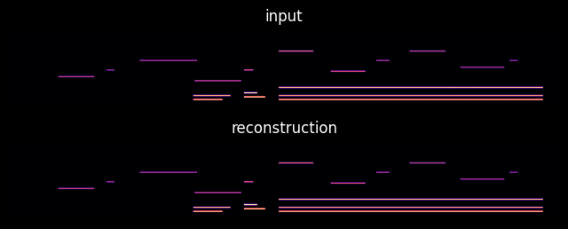
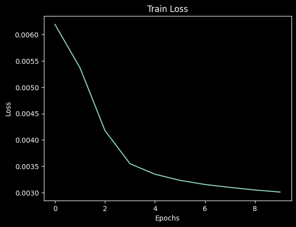
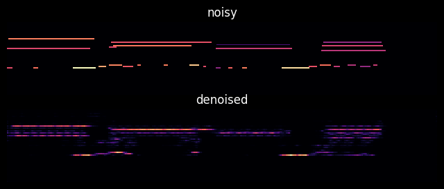

# Autoencoders for MIDI

## Model

Model is based off [this](https://colab.research.google.com/github/ashishpatel26/Awesome-Pytorch-Tutorials/blob/main/10.Pytorch%20AutoEncoder%20Neural%20Network%20for%20Image%20Denoising.ipynb).

## Inputs and Outputs
### Input
The input is one or more Ableton projects. Each live project contains 2 tracks:
1. A MIDI track which has 1 or more midi clips of piano music on it
2. an audio track which has a recording of the music being played as well as an audible metronome and some voice annotations

#### Assumptions:
1. tempo is consistent throughout the project
2. the first note of a midi clip is a valid starting point for a loop
3. a midi clip contains valid loops from start to end, though the final loop can potentially be dropped
4. the midi clip is in 1/4 or 4/4

### Output
A bunch of piano rolls stored in some format to be decided. The piano rolls have had the following dimensionality reduction techniques applied:
1. scaling the note velocity from \[0 - 127] to \[0 - 1]
2. removing all rows above and below the lowest and highest notes, respectively, in the dataset.

> Note: the rolls have also been padded to all be the same length, since the midi clip ends at the end of the last note, not at a given time

Remaining to try is quantizing the piano rolls to some degree (start with 12 sections per beat)

### Data Augmentation
#### Try First (all complete)
1. pixel corruption
2. transpose up/down
3. velocity scaling
4. ignore tempo scale factor

#### Try After
1. If density < threshold, then double speed
2. Take whole image and shift it by 1/4 or 1/2 with wraparound
3. pad with looped data
4. more modifications of velocities

### Experiments
#### Overfit

#### Default Settings
| Setting       | Value |
| ------------- | ----- |
| NUM_EPOCHS    | 10    |
| LEARNING_RATE | 0.001 |
| BATCH_SIZE    | 32    |
| NOISE_FACTOR  | 0.5   |

#### Little Noise
